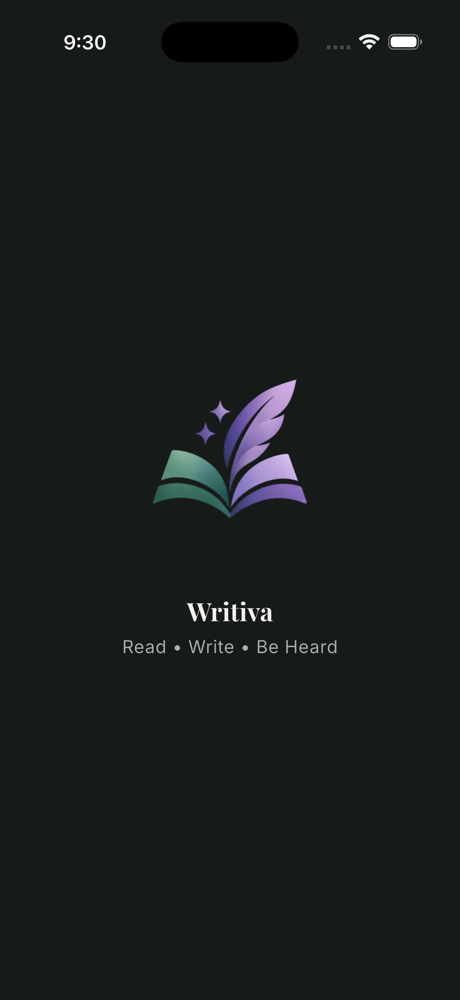
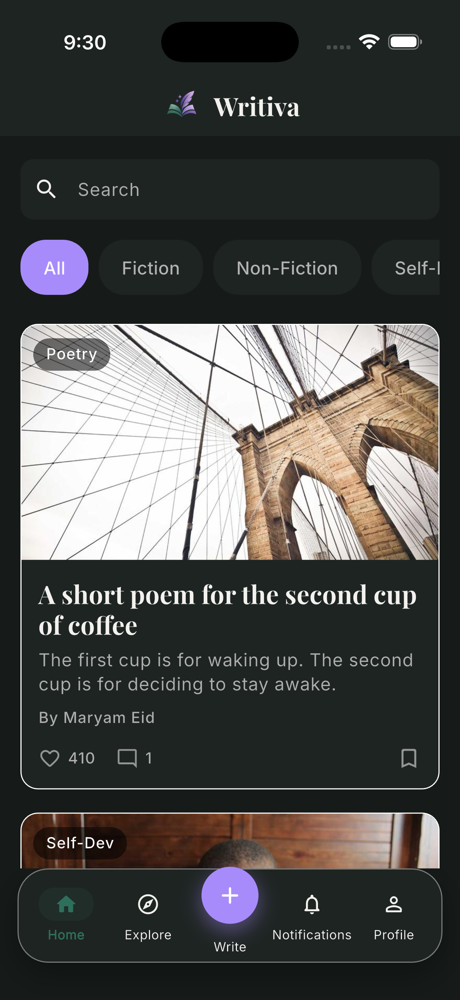
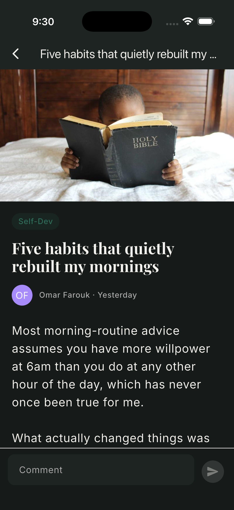
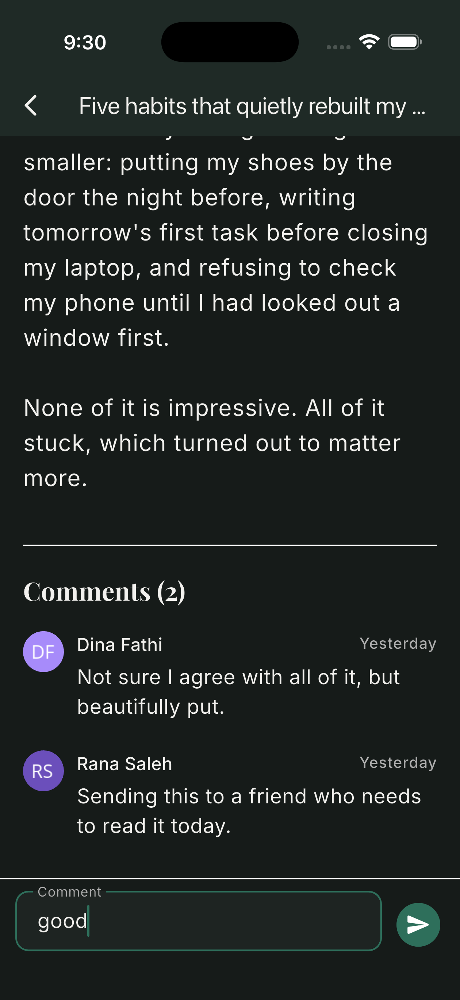
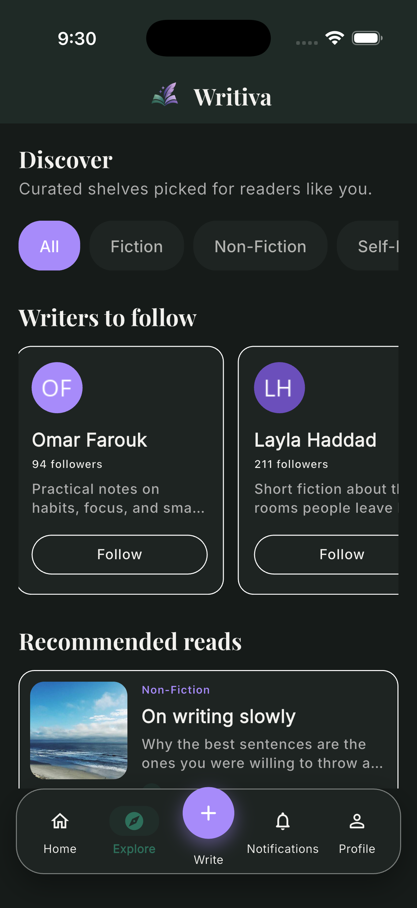
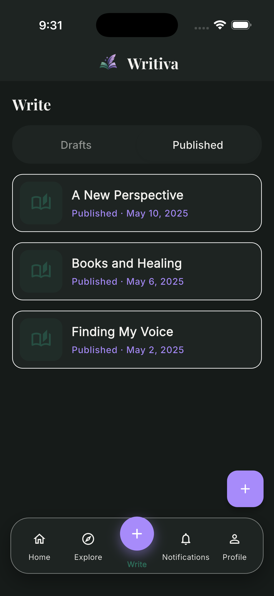
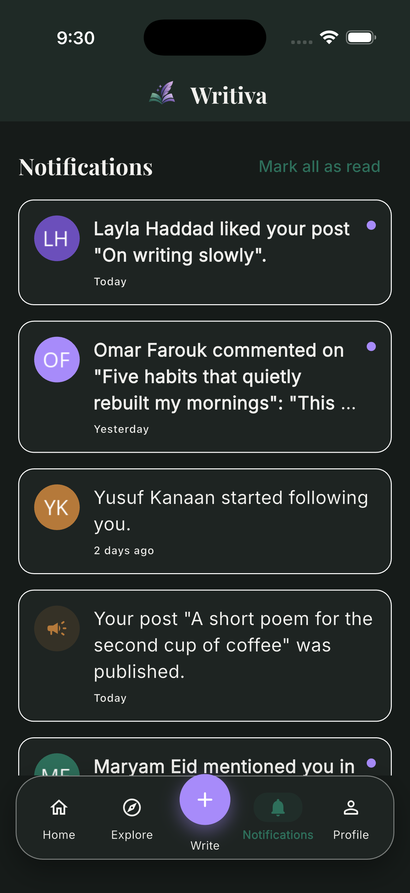
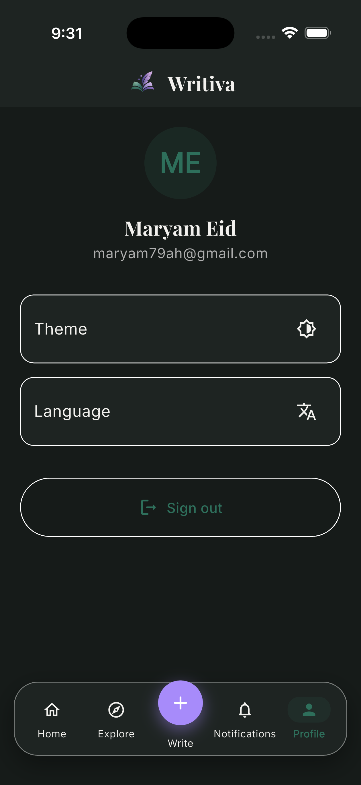
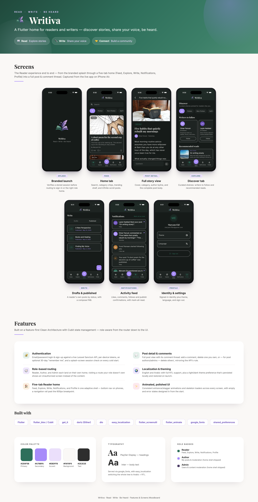

# Writiva

<p align="center">
  
</p>

**Read • Write • Be Heard**

Writiva is a place where readers discover new worlds and writers share their voices. It's a Flutter app that turns ideas into stories, built around three roles: **Reader**, **Author**, and **Admin**.

> The Flutter package and internal class names still use the working codename `mind_whispers_app`; the product-facing brand is Writiva.

## Brand pillars

| Pillar | Meaning |
|---|---|
| 📖 Read | Explore stories |
| ✒️ Write | Share your voice |
| 🤝 Connect | Build a community |

## Demo

[](https://youtube.com/shorts/GUZTVza22eY)

A short walkthrough of the Reader experience — splash, feed, post detail, and the rest of the tab shell.

## Screenshots

| Screen | Preview | What it shows |
|---|---|---|
| Splash |  | Branded launch screen while a stored session is verified. |
| Feed (Home) |  | Search, category chips, a trending shelf, and the infinite-scroll post list. |
| Post detail |  | Cover image, category, author byline, and the full post body. |
| Comments |  | The post's comment thread and composer. |
| Explore |  | Curated shelves: writers to follow and recommended reads. |
| Write |  | A reader's own drafts and published posts, with a compose FAB. |
| Notifications |  | Likes, comments, follows, and publish confirmations, with mark-all-read. |
| Profile |  | Signed-in identity plus theme, language, and sign-out. |

> Login, sign-up, and the Author/Admin placeholder homes aren't captured yet. Drop PNGs into `docs/screenshots/` using the same naming pattern and they'll render here.

## Features

- **Authentication** — email/password login and sign-up against a live Laravel Sanctum API, with per-device tokens (`device_name`), an optional 30-day "remember me" session, and a splash-screen session check (`/auth/me`) on every cold start.
- **Role-based routing** — a signed-in user's role (`reader` / `author` / `admin`) picks their home screen and gates every role-scoped route; visiting a route your role doesn't own shows an Unauthorized screen instead of the content.
- **Reader home — five tabs in one adaptive shell** — bottom nav on phones, a navigation rail past the 600px breakpoint:
  - **Feed** — search, category filters, a trending shelf, pull-to-refresh, infinite scroll, skeleton loading, and empty/error states.
  - **Explore** — curated category chips, a "writers to follow" shelf, and a recommended-reads shelf.
  - **Write** — a reader's own drafts and published posts by status; composing a new post isn't built yet, so the FAB says so instead of doing nothing.
  - **Notifications** — an activity feed (likes, comments, follows, publish confirmations) with mark-all-read; read state is per-session, not persisted.
  - **Profile** — identity from `/auth/me`, theme + language toggles, and sign-out.
- **Post detail & comments** — full post view with its comment thread: add a comment, and delete one you own (or, for post authors/admins, delete others' — mirroring the API's delete rule).
- **Author & Admin homes** — placeholder shells today (My Posts/moderation for Author, users/content moderation for Admin are next), already wired through the same adaptive layout, theming, and role guard the finished screens will use.
- **Localization** — English and Arabic out of the box, with full RTL support via `easy_localization`.
- **Light/dark theming** — user preference persisted locally and restored on launch, toggleable from Profile.
- **Animated UI** — consistent entrance/stagger animations and skeleton loaders powered by `flutter_animate`.

The Feed and post/comment data come from a live-shaped fake data source (`ReaderFakeDataSource`) that mirrors the real backend API's shapes, so the Reader experience is fully explorable without a live backend. Explore, Write, and Notifications go a step further today: there's no explore, "my posts", or notifications endpoint yet, so those three tabs render static sample data directly rather than going through `ReaderRepository`. Auth already talks to the real backend API.

## Brand identity

**Typography:** Playfair Display for headings, Inter for body text (via `google_fonts`).

**Voice:** Calm · Creative · Friendly · Modern · Inspirational

**Color palette:**

| Swatch | Hex | Role |
|---|---|---|
| 🟩 | `#2E6F5B` | Primary |
| 🟪 | `#A78BFA` | Secondary |
| 🔳 | `#EBDFFB` | Accent |
| ⬜ | `#FAF8F6` | Background (light) |
| ⬛ | `#2E2E2E` | Text (light) |

Role badges: Reader `#2E6F5B` · Author `#A78BFA` · Admin `#4A3B63`.

See `docs/branding/writiva_brand_board.png` for the brand identity board (logo, icon, typography, and mood imagery), and `docs/branding/writiva_app_moodboard.png` for a moodboard of the shipped features and every Reader screen, built from the real screenshots above. This palette is implemented in `lib/core/theme/app_colors.dart`, and the app icon across Android/iOS/web is generated from `assets/icon/icon.png` via `flutter_launcher_icons`.

<p align="center">
  
</p>

## Architecture

The project follows a feature-first Clean Architecture layout:

```
lib/
├── core/            # Shared infrastructure: DI, routing, networking, theming,
│                    # error handling, auth, animations, and common widgets
└── features/        # One folder per feature (intro, auth, reader, author, admin, ...)
```

Each feature that talks to a backend follows the same three layers: a data source (fake or remote) → a repository (implementing an abstract contract, returning `Either<Failure, T>`) → a Cubit that the UI listens to. State management uses **Cubit** (`flutter_bloc`), dependency injection uses `get_it`, and error handling uses `dartz`'s `Either` for typed success/failure results instead of exceptions.

## Tech stack

| Concern | Package |
|---|---|
| State management | `flutter_bloc` / `equatable` |
| Dependency injection | `get_it` |
| Error handling | `dartz` |
| Localization | `easy_localization` |
| Networking | `dio` (+ `pretty_dio_logger` for request/response logging) |
| Local storage | `shared_preferences` |
| Responsive layout | `flutter_screenutil` |
| Animations | `flutter_animate` |
| Fonts | `google_fonts` |
| Vector assets | `flutter_svg` |
| Config | `flutter_dotenv` |

## Getting started

1. Install [Flutter](https://docs.flutter.dev/get-started/install) (SDK `^3.12.2`).
2. Install dependencies:
   ```
   flutter pub get
   ```
3. Copy `.env.example` to `.env` (or create one) with the API base URL, loaded via `flutter_dotenv` at startup:
   ```
   API_BASE_URL=https://mind-whispers.laravel.cloud/api
   ```
4. Run the app:
   ```
   flutter run
   ```

Signing up or logging in requires that live API. Everything under the Reader role (feed, post detail, comments) works offline against the bundled fake data source once you're past auth.

## Localization

Translation strings live in `assets/translations/en.json` and `assets/translations/ar.json`. Add new keys to both files to keep locales in sync.
